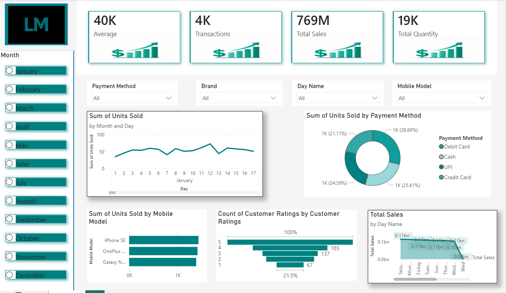

# mobile_sales_analysis

# 📊 Sales Dashboard (Power BI)

## Overview
Built an interactive Power BI dashboard to analyze sales performance and identify key trends.

## Key Metrics
- Total Sales  
- Transactions  
- Quantity Sold  
- Sales Growth (MoM)  

## Features
- Monthly sales trend analysis  
- Top-performing products  
- Category/payment insights  
- Interactive filters for dynamic analysis  

## Tools Used
- Power BI  
- DAX  

## Outcome
Converted raw sales data into clear, actionable insights using data visualization and basic analytics.
